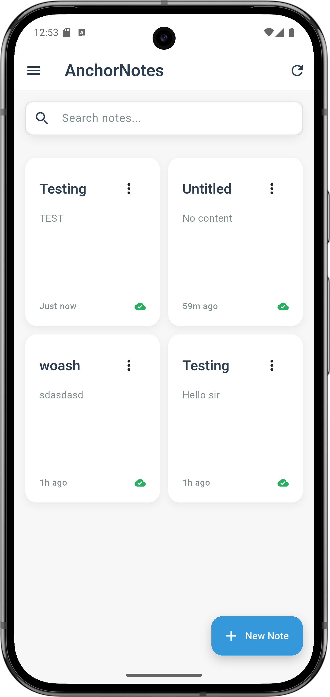
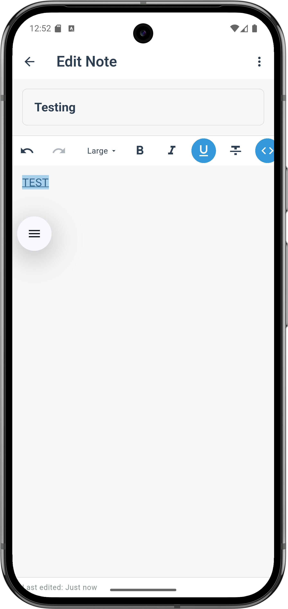
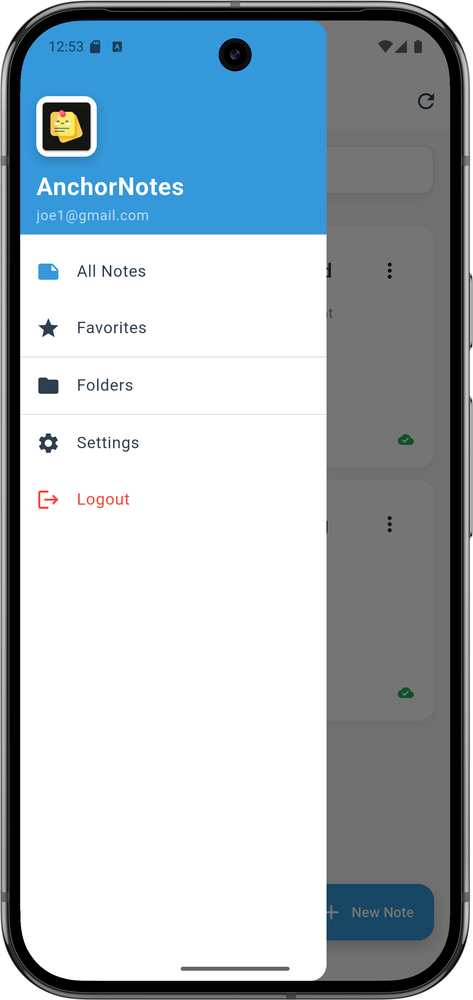
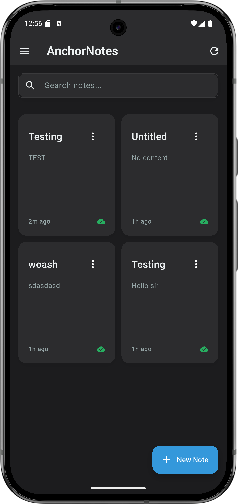

# 📝 AnchorNotes

> A beautiful, offline-first note-taking app with real-time collaboration, rich text editing, and smart organization.

[](https://flutter.dev)
[](https://firebase.google.com)
[](https://dart.dev)
[](LICENSE)
[](https://flutter.dev)

---

## 🌟 Overview

**AnchorNotes** is a modern, feature-rich note-taking application built with Flutter. It combines the power of offline-first architecture with real-time cloud synchronization, making it perfect for personal note-taking and team collaboration.

### Why AnchorNotes?

- 🚀 **Lightning Fast** - Works seamlessly offline with instant sync
- ✨ **Rich Text Editing** - Format your notes with 20+ styling options
- 📁 **Smart Organization** - Folders, favorites, and powerful search
- 👥 **Real-Time Collaboration** - Share notes with team members
- 🎨 **Beautiful UI** - Modern Material Design 3 with dark mode
- 🔒 **Secure** - Firebase authentication and permission-based access
- 📤 **Export Anywhere** - PDF, Markdown, or plain text

## ✨ Features

### 📱 Core Functionality
- **Offline-First Architecture** - Work seamlessly without internet
- **Real-Time Sync** - Changes sync instantly across devices
- **Rich Text Editor** - Bold, italic, headers, lists, colors, and more
- **Folders & Organization** - Organize notes into custom folders
- **Favorites** - Star important notes for quick access
- **Multi-Note Management** - Create, edit, delete unlimited notes
- **Fast Search** - Find notes quickly by title or content
- **Auto-Save** - Never lose your work

### ✍️ Rich Text Editing
- **Text Formatting** - Bold, italic, underline, strikethrough
- **Headers** - H1, H2, H3 for document structure
- **Lists** - Bullet points, numbered lists, checkboxes
- **Alignment** - Left, center, right, justify
- **Colors** - Text color and background highlighting
- **Code** - Code blocks and inline code snippets
- **Quotes** - Block quotes for emphasis
- **Links** - Add hyperlinks to text
- **Undo/Redo** - Full edit history
- **Toolbar Toggle** - Hide/show formatting toolbar

### 📤 Export & Sharing
- **Export to PDF** - Professional documents with formatting
- **Export to Markdown** - `.md` files with metadata
- **Export as Text** - Plain text `.txt` files
- **Share Files** - Native share integration
- **Collaborate** - Share notes with team members via email

### 👥 Collaboration Features
- **Permission Levels** - Owner, Editor, Viewer roles
- **Real-Time Sync** - Changes sync instantly across devices
- **Manage Collaborators** - Add, remove, or change permissions
- **Permission Revocation** - Notes disappear when access is removed
- **Owner Controls** - Only owners can share notes

### 📁 Organization
- **Custom Folders** - Create folders with icons and colors
- **Move Notes** - Organize notes into folders
- **Favorites** - Star important notes
- **Filter Views** - All Notes, Favorites, or by Folder
- **Note Counts** - See how many notes in each folder
- **Search** - Find notes by title or content

### 🎨 User Experience
- **Beautiful UI** - Modern Material Design 3
- **Dark Mode** - Automatic theme switching
- **Smooth Animations** - Hero transitions, page animations
- **Navigation Drawer** - Clean hamburger menu navigation
- **Error Handling** - User-friendly error messages
- **Success Feedback** - Visual confirmation for actions
- **Auto-Save** - Never lose your work (2-second debounce)

### ⚙️ Settings & Customization
- **Theme Selection** - Choose between Light, Dark, or System default themes
- **Default View Mode** - Switch between Grid view and List view for notes
- **Font Size Adjustment** - Customize text size from 12px to 20px
- **Auto-Save Toggle** - Enable or disable automatic note saving
- **Export Format Preference** - Set default export format (PDF, TXT, or MD)
- **Sync Status** - Monitor cloud synchronization status
- **Cache Management** - Clear temporary files to free up storage
- **Version Information** - View app version and build details

### 🔐 Security & Privacy
- **Firebase Authentication** - Email/password and Google Sign-In
- **Firestore Security Rules** - Permission-based access control
- **Data Isolation** - Each account's data is completely separate
- **Secure Sharing** - Email-based collaboration only

---

## 📸 Screenshots

### 📱 Main Interface




### 🌙 Dark Mode


---

## 🏗️ Architecture

### Tech Stack
- **Frontend**: Flutter (Dart)
- **Local Database**: Isar (NoSQL, embedded)
- **Backend**: Firebase (Firestore, Authentication)
- **State Management**: ValueNotifier, StreamBuilder
- **Architecture Pattern**: Service-oriented with single source of truth

### Key Components

#### 📦 Data Layer
- **Note Model** - Isar entity with Firestore serialization
- **Folder Model** - Custom folders with icons and colors
- **IsarService** - Local CRUD operations
- **SyncService** - Bidirectional sync with Firestore
- **FolderService** - Folder management
- **ExportService** - PDF, Markdown, and text export

#### 🎯 Business Logic
- **AuthService** - Authentication and user management
- **Last Write Wins** - Conflict resolution via timestamps
- **Permissions Map** - Single source of truth for access control
- **Auto-Save** - Debounced saving (2-second delay)

#### 🖼️ Presentation Layer
- **NotesListScreen** - Grid view with search and filters
- **RichNoteEditorScreen** - Rich text editing with Flutter Quill
- **FoldersScreen** - Folder management UI
- **FolderNotesScreen** - Notes filtered by folder
- **SharingDialog** - Collaborator management
- **AuthScreen** - Login/signup with Google Sign-In

### Data Flow

```
┌─────────────┐
│   User UI   │
└──────┬──────┘
       │
       ↓
┌─────────────┐     ┌──────────────┐
│ Isar (Local)│ ←→  │ SyncService  │
└─────────────┘     └──────┬───────┘
                           │
                           ↓
                    ┌──────────────┐
                    │  Firestore   │
                    │  (Cloud)     │
                    └──────────────┘
```

### Firestore Structure

```
notes/
  {noteId}/
    - title: string
    - content: string (JSON for rich text, or plain text)
    - ownerId: string
    - folderId: string (optional)
    - folderName: string (optional)
    - isFavorite: boolean
    - permissions: {
        "userId1": "owner",
        "userId2": "editor",
        "userId3": "viewer"
      }
    - createdAt: timestamp
    - updatedAt: timestamp

folders/
  {folderId}/
    - name: string
    - color: string
    - icon: string
    - ownerId: string
    - noteCount: number
    - createdAt: timestamp
    - updatedAt: timestamp

users/
  {userId}/
    - email: string
    - createdAt: timestamp
```

### Key Packages

```yaml
dependencies:
  flutter: sdk
  isar: ^3.1.0+1              # Local database
  isar_flutter_libs: ^3.1.0+1
  firebase_core: ^2.24.2       # Firebase SDK
  firebase_auth: ^4.16.0       # Authentication
  cloud_firestore: ^4.14.0     # Cloud database
  google_sign_in: ^6.2.1       # Google auth
  flutter_quill: ^9.3.20       # Rich text editor
  pdf: ^3.10.8                 # PDF generation
  printing: ^5.12.0            # Print/share PDF
  share_plus: ^7.2.2           # Share files
  path_provider: ^2.1.2        # File system access
```

---

## 🚀 Getting Started

### Quick Start (5 minutes)

Want to try it out quickly? Follow these steps:

1. **Clone & Install**
   ```bash
   git clone https://github.com/4LatinasOnMe/anchornotes.git
   cd anchornotes
   flutter pub get
   ```

2. **Set up Firebase** (one-time setup)
   - Create project at [console.firebase.google.com](https://console.firebase.google.com)
   - Enable Authentication (Email/Password + Google Sign-In)
   - Create Firestore database (start in test mode)
   - Run: `flutterfire configure` (installs CLI if needed)

3. **Update Security Rules**
   - Copy rules from `FIRESTORE_SECURITY_RULES.md`
   - Paste in Firebase Console → Firestore → Rules → Publish

4. **Run!**
   ```bash
   flutter run
   ```

That's it! 🎉

---

### Detailed Installation

#### Prerequisites
- Flutter SDK (3.x or higher)
- Dart SDK (3.x or higher)
- Firebase account (free tier works great)
- Android Studio / VS Code
- Git

#### Step-by-Step Setup

**1. Clone the repository**
```bash
git clone https://github.com/4LatinasOnMe/anchornotes.git
cd anchornotes
```

**2. Install dependencies**
```bash
flutter pub get
```

**3. Set up Firebase**

Create a new Firebase project:
- Go to [console.firebase.google.com](https://console.firebase.google.com)
- Click "Add project" and follow the wizard
- Enable Authentication:
  - Go to Authentication → Sign-in method
  - Enable "Email/Password"
  - Enable "Google" (optional but recommended)
- Create Firestore database:
  - Go to Firestore Database → Create database
  - Start in **test mode** (we'll add security rules next)
  - Choose a location close to your users

**4. Configure Firebase for Flutter**
```bash
# Install FlutterFire CLI (if not already installed)
dart pub global activate flutterfire_cli

# Configure Firebase for your project
flutterfire configure
```

This will:
- Detect your Firebase projects
- Generate platform-specific config files
- Create `firebase_options.dart`

**5. Update Firestore Security Rules**

⚠️ **Important for security!**

- Open `FIRESTORE_SECURITY_RULES.md` in this repo
- Copy the rules
- Go to Firebase Console → Firestore → Rules
- Paste the rules and click **Publish**

**6. Generate Isar schemas**
```bash
dart run build_runner build --delete-conflicting-outputs
```

**7. Run the app**
```bash
# For Android/iOS
flutter run

# For Web
flutter run -d chrome

# For specific device
flutter devices
flutter run -d <device-id>
```

---

## 📖 Usage

### Creating & Editing Notes
1. Tap the **+** button (FAB) on home screen
2. Enter a title and start writing
3. Use the formatting toolbar for rich text
4. Changes auto-save every 2 seconds
5. Tap **⋮** menu → "Save Now" for manual save

### Organizing with Folders
1. Tap **☰** menu → "Folders"
2. Tap **+** to create a new folder
3. Choose name, icon, and color
4. Open any note → **⋮** menu → "Move to Folder"
5. Select folder or "No Folder"

### Using Favorites
1. Open any note
2. Tap **⋮** menu → "Favorite" (⭐)
3. View all favorites: **☰** menu → "Favorites"
4. Favorites appear at the top of lists

### Sharing & Collaboration
1. Open a note you own
2. Tap **⋮** menu → "Share with others"
3. Enter collaborator's email
4. Select permission level (Editor/Viewer)
5. Tap **Share**
6. Collaborators receive instant access

### Exporting Notes
1. Open any note
2. Tap **⋮** menu → Export option:
   - **Export as PDF** - Professional document
   - **Export as Markdown** - `.md` file
   - **Export as Text** - Plain `.txt` file
3. Share via native share sheet

### Searching Notes
1. Type in the search bar on home screen
2. Results filter in real-time
3. Search by title or content
4. Clear search to see all notes

---

## 🏛️ Project Structure

```
lib/
├── main.dart                          # App entry point
├── models/
│   ├── note.dart                      # Note data model
│   └── folder.dart                    # Folder data model
├── screens/
│   ├── auth_gate.dart                 # Auth state management
│   ├── auth_screen.dart               # Login/signup UI
│   ├── home_screen.dart               # Main container
│   ├── notes_list_screen.dart         # Notes grid view with filters
│   ├── rich_note_editor_screen.dart   # Rich text editor
│   ├── folders_screen.dart            # Folder management
│   ├── folder_notes_screen.dart       # Notes by folder
│   └── sharing_dialog.dart            # Collaboration UI
├── widgets/
│   ├── folder_picker.dart             # Folder selection dialog
│   ├── shimmer_loading.dart           # Loading skeletons
│   └── error_banner.dart              # Error feedback
├── services/
│   ├── auth_service.dart              # Authentication
│   ├── isar_service.dart              # Local database
│   ├── sync_service.dart              # Cloud sync
│   ├── folder_service.dart            # Folder operations
│   ├── export_service.dart            # PDF/Markdown export
│   └── sharing_service.dart           # Collaboration
└── theme/
    ├── app_theme.dart                 # Theme configuration
    └── app_colors.dart                # Color palette
```

---

## 🎯 Development Phases

**Total Development Time:** ~6 weeks (September - October 2025)

### Phase 1: Foundation ✅ (Week 1)
- Basic Flutter setup
- Single note editor
- Local persistence with Isar

### Phase 2: Authentication ✅ (Week 2)
- Firebase Authentication
- Email/password login
- Google Sign-In
- User management

### Phase 3: Cloud Sync ✅ (Week 3)
- Firestore integration
- Bidirectional sync
- Offline-first architecture
- Conflict resolution

### Phase 4: Collaboration ✅ (Week 4)
- Multi-note management
- Note sharing
- Permission system
- Real-time collaboration
- Single source of truth refactor

### Phase 5: Polish & Refinement ✅ (Week 5)
- Animations and transitions
- Error handling
- Loading states
- Performance optimization
- App icon and splash screen
- Comprehensive documentation

### Phase 6: Enhanced Features ✅ (Week 6)
- **Folders & Organization** - Custom folders with icons and colors
- **Favorites** - Star important notes
- **Navigation Drawer** - Clean hamburger menu
- **Rich Text Editor** - 20+ formatting options with Flutter Quill
- **Export Features** - PDF, Markdown, and text export
- **Sync Documentation** - Transparent about limitations

---

## 🗺️ Roadmap

### Potential Future Features
- [ ] **Note Templates** - Pre-built templates for common note types
- [ ] **Tags System** - Multiple tags per note
- [ ] **Advanced Search** - Filter by date, tags, collaborators
- [ ] **Note History** - Version control and restore
- [ ] **Attachments** - Images, files, voice notes
- [ ] **Reminders** - Set reminders for notes
- [ ] **Widgets** - Home screen widgets
- [ ] **Desktop Apps** - Windows, macOS, Linux
- [ ] **CRDT Sync** - True real-time collaborative editing
- [ ] **End-to-End Encryption** - Privacy-first option
- [ ] **Offline Maps** - Location-based notes
- [ ] **API** - Public API for integrations

**Want to contribute?** Pick a feature and open a PR!

---

## 🐛 Known Issues & Solutions

### Issue: Notes from other accounts appear
**Solution**: Sign out and sign back in. The app now clears local data on auth changes.

### Issue: Permission denied error
**Solution**: Ensure Firestore security rules are updated from `FIRESTORE_SECURITY_RULES.md`

### Issue: Sync conflicts
**Solution**: The app uses "Last Write Wins" - the most recent change is kept.

### Issue: Rich text shows as JSON in preview
**Solution**: This was fixed in Phase 6. Update to the latest version.

---

## ⚡ Performance

### Benchmarks
- **App Launch**: < 2 seconds (cold start)
- **Note Load**: < 100ms (from local database)
- **Search**: Real-time filtering (< 50ms)
- **Sync**: < 500ms (average, depends on network)
- **Export PDF**: < 2 seconds (typical note)

### Optimization Techniques
- **Lazy Loading** - Notes load on-demand
- **Debounced Auto-Save** - Reduces write operations
- **Local-First** - Instant UI updates
- **Indexed Search** - Fast full-text search with Isar
- **Efficient Sync** - Only changed notes sync
- **Image Caching** - Reduced network usage

---

## ❓ FAQ

**Q: Is my data private?**  
A: Yes! Your notes are stored in your personal Firebase account. Only you and people you explicitly share with can access your notes.

**Q: Can I use this offline?**  
A: Absolutely! The app is offline-first. All features work without internet. Changes sync when you're back online.

**Q: How much does it cost?**  
A: The app is free and open-source. You only pay for Firebase usage (which has a generous free tier).

**Q: Can I self-host?**  
A: Yes! Set up your own Firebase project and you control all the data.

**Q: What happens if two people edit the same note offline?**  
A: The app uses "Last Write Wins" - the most recent change is kept. See [RICH_TEXT_SYNC_LIMITATIONS.md](RICH_TEXT_SYNC_LIMITATIONS.md) for details.

**Q: Can I export all my notes at once?**  
A: Currently, you export one note at a time. Bulk export is on the roadmap!

**Q: Does it work on iOS?**  
A: Yes! The app is built with Flutter and works on Android, iOS, and Web.

**Q: How do I report a bug?**  
A: Open an issue on GitHub with steps to reproduce. We appreciate detailed bug reports!

---

## 🤝 Contributing

Contributions are welcome! Please follow these steps:

1. Fork the repository
2. Create a feature branch (`git checkout -b feature/AmazingFeature`)
3. Commit your changes (`git commit -m 'Add some AmazingFeature'`)
4. Push to the branch (`git push origin feature/AmazingFeature`)
5. Open a Pull Request

---

## ⚠️ Important Notes

### Rich Text Sync Limitations

AnchorNotes uses a "Last Write Wins" strategy for rich text sync. This means:
- ✅ Works great for personal notes
- ✅ Works great for single-user editing
- ⚠️ Concurrent edits may conflict (last person to sync wins)

**For full details, see:** [RICH_TEXT_SYNC_LIMITATIONS.md](RICH_TEXT_SYNC_LIMITATIONS.md)

**Best Practices:**
- Stay online when collaborating on rich text notes
- Check "Last edited" timestamp before editing shared notes
- Use plain text for heavy collaboration scenarios

---

## 📝 License

This project is licensed under the MIT License - see the [LICENSE](LICENSE) file for details.

---

## 🙏 Acknowledgments

Special thanks to the open-source community and these amazing projects:

- **Flutter Team** - For the amazing cross-platform framework
- **Firebase** - For the robust backend infrastructure
- **Isar** - For the lightning-fast local database
- **Flutter Quill** - For the rich text editor
- **PDF & Printing** - For document generation
- **Share Plus** - For easy file sharing

---

## 📧 Contact & Support

Have questions or need help? Open an issue on GitHub!

**Project Link**: [https://github.com/4LatinasOnMe/anchornotes](https://github.com/4LatinasOnMe/anchornotes)

**Found a bug?** Please file an issue with detailed steps to reproduce.

**Want to contribute?** We welcome pull requests! See the Contributing section above.

---

## 🎓 Learning Resources

This project demonstrates real-world Flutter development including:

### Core Concepts
- Offline-first architecture
- Real-time collaboration
- State management with ValueNotifier
- Clean architecture patterns
- Error handling & loading states

### Firebase Integration
- Authentication (Email/Google)
- Cloud Firestore
- Security Rules
- Real-time sync

### Local Database
- Isar NoSQL database
- Full-text search
- Relations & indexing
- Offline persistence

### UI/UX
- Material Design 3
- Responsive layouts
- Smooth animations
- Dark/light theme
- Accessibility

Perfect for learning Flutter development! 🚀

---

## 🌟 Support This Project

If you find this project useful, please consider:

1. ⭐ **Star** the repository
2. 🐛 Report bugs and issues
3. 💡 Suggest new features
4. 📣 Share with others
5. 🤝 Contribute code

---

**Built with ❤️ using Flutter**

[](https://flutter.dev/)
[](https://firebase.google.com/)
[](https://opensource.org/licenses/)

---

<div align="center">
  
**Author:** Geogory Mui Tian Jie ([@4LatinasOnMe](https://github.com/4LatinasOnMe))

Made with Flutter ♥ | 2025

</div>
